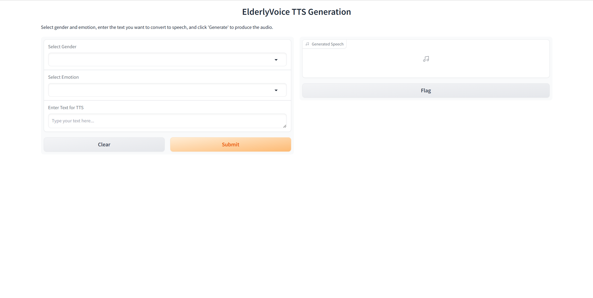

# Elderly-Voice
This project focuses on text-to-speech (TTS) tasks tailored for elderly individuals. Built upon the CosyVoice framework, it allows users to select both the target gender and the desired emotional tone for TTS outputs.
## Webpage Demo

